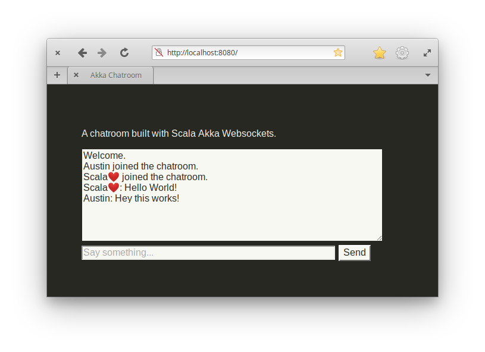

# Akka-Websockets-Demo

A chatroom built with Scala Akka Websockets.



### Usage

Requires [JDK 8](https://adoptopenjdk.net/) and [sbt](https://www.scala-sbt.org/).

```bash
# Start the server
$ sbt run
```

Now you can visit http://localhost:8080/
